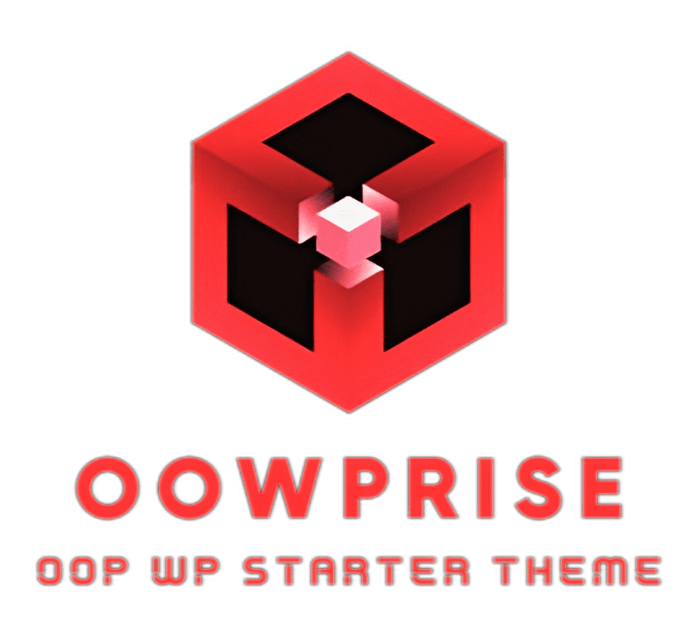

# OOWPrise
OOWPrise is a WordPress starter theme that heavily employs object-oriented programming techniques and modern WordPress tools.

[](https://packagist.org/packages/gturpin/oowprise?color=red)
[](https://packagist.org/packages/gturpin/oowprise)

<p align="center">
  
</p>

## Installation

You can install OOWPrise using the following methods:

```sh
composer create-project gturpin-dev/oowprise
```

After that, you must install the theme's dependencies :

```sh
composer install
npm install

# Or with the provided Makefile
make install
```

## Usage

You have a built-in development environment that you can use to develop your theme without a WP installation.

It requires [Docker](https://www.docker.com/) and [wp-env](https://developer.wordpress.org/block-editor/reference-guides/packages/packages-env/) to be installed on your machine.

You have access to the following commands :

```sh
wp-env start # Start the development environment
wp-env stop # Stop the development environment

# Or with the provided Makefile
make server:start
make server:stop
```

## Documentation

### Build assets

To build assets, you can use the following commands :

```sh
npm run start:theme # Watch CSS/JS assets for development
npm run build:theme # Build CSS/JS assets for production

# Or with the provided Makefile
make start:theme
make build:theme
```

### Gutenberg blocks

OOWPrise comes with a built-in block system that allows you to create blocks in a simple way.

You can create a new block using the following command :

```sh
make create-block

# Or with slug parameter to skip the prompt
make create-block slug=your-block-slug
```

This command will create a new block in the `resources/blocks` directory. Refer to the [@wordpres/create-block documentation](https://developer.wordpress.org/block-editor/reference-guides/packages/packages-create-block/) for more information.

To build your block, you can use the following command :

```sh
npm run start:blocks # Watch blocks for development
npm run build:blocks # Build blocks for production

# Or with the provided Makefile
make start:blocks
make build:blocks
```

## Deployment

You can deploy your theme using the following command :

```sh
npm run theme-zip

# Or with the provided Makefile
make zip
```

This command will create a zip archive of your theme that can be uploaded to a WordPress installation.

## Contributing

TODO: Write contribution guidelines

## Credits

TODO: Write credits

## License

The OOWPrise starter theme is open-sourced software licensed under the [MIT license](LICENSE.md).
