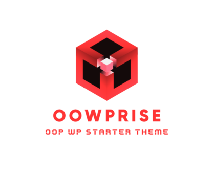

# OOWPrise
OOWPrise is a WordPress starter theme that heavily employs object-oriented programming techniques.

<p align="center">
  
</p>

# OOWPrise

OOWPrise is a WordPress starter theme that heavily employs object-oriented programming techniques.

## Installation

You can install OOWPrise using the following methods:

### Classic Composer Install

```sh
composer create-project gturpin-dev/oowprise
```

## Usage

TODO: Write usage instructions

## Contributing

TODO: Write contribution guidelines

## Credits

TODO: Write credits

## License

The OOWPrise theme is open-sourced software licensed under the [MIT license](LICENSE.md).
