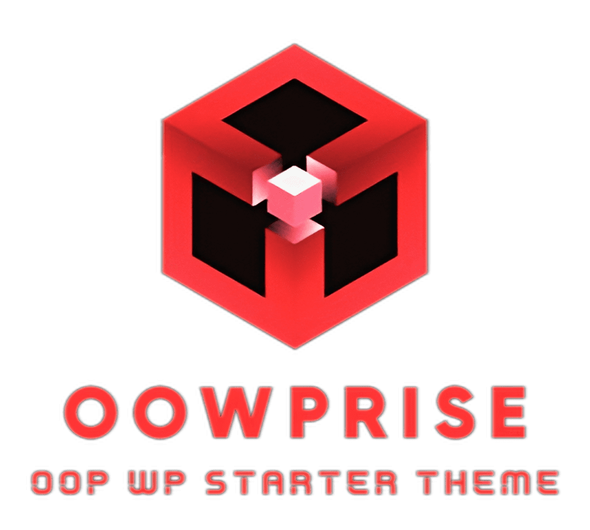

  

# OOWPrise <small>1.0.0</small>

> OOWPrise is a WordPress starter theme that heavily employs object-oriented programming techniques and modern WordPress tools.

- Full OOP architecture and modern principles
- Developer friendly
- Fully customizable
- According to the WordPress Coding Standards and philosophy

[GitHub](https://github.com/gturpin-dev/OOWPrise/)
[Get Started](getting_started/quickstart)

<!-- Background color -->

